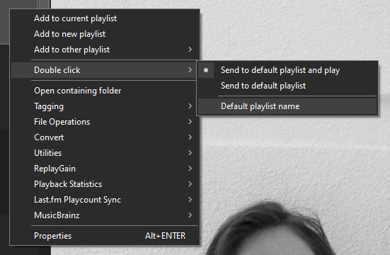
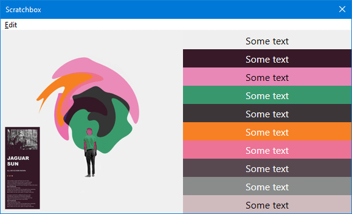

### Changes
- The minimum requirement for [foobar2000](https://foobar2000.org) is now `2.0`.
- [IMetadbHandle GetFileInfo](../../interfaces/IMetadbHandle/#getfileinfo) has been updated so the previously
optional `full_info` argument is not needed at all. Any supplied value will be ignored and the return value
should always be valid.
- The `Editor Properties` in the main `Preferences` will be reset as the component now uses a brand new storage
mechanism built in to [foobar2000](https://foobar2000.org).
- [window.IsDark](../../namespaces/window/) has been updated to report `Default UI` `Dark Mode`.

### New additions
- `64bit` builds are now available.
- The `Preferences` and all popup dialogs have been updated to support `Dark Mode`. This depends on `Dark Mode`
being enabled in the `Default UI` `Preferences` regardless of which user interface you use.
- The colours for the text edit area in the [Configuration Window](../../configuration-window/) do not change
dynamically. If using `Dark Mode`, try the new `Dark Grey` preset.
- The [IMetadbHandle](../../interfaces/IMetadbHandle/) interface has a new `FileCreated` property. Unlike the new `%file_created%`, this is a timestamp.
- There is a new [on_console_refresh](../../callbacks#on_console_refresh) callback and you can retrieve
all `Console` messages using [console.GetLines](../../namespaces/console/#consolegetlineswith_timestamp). Additonally,
you can clear all messages with [console.ClearBacklog](../../namespaces/console/#consoleclearbacklog).
- The [on_main_menu](../../callbacks#on_main_menuindex) callback last seen in the `2.x` series is back.
- Add [utils.TextBox](../../namespaces/utils/#utilstextboxprompt-title-default_value) which
provides a multi-line text edit area. Note that it always throws an error when cancelled so you must use `try/catch`.
- Add [utils.Run](../../namespaces/utils/#utilsrunapp-params).
- Add [utils.RunCmdAsync](../../namespaces/utils/#utilsruncmdasyncwindow_id-app-params) and [on_run_cmd_async_done](../../callbacks/#on_run_cmd_async_donetask_id).
- Add [ITitleFormat EvalPlaylistItem](../../interfaces/ITitleFormat/#evalplaylistitemplaylistindex-playlistitemindex). This is
in addition to the [ITitleFormat EvalActivePlaylistItem](../../interfaces/ITitleFormat/#evalactiveplaylistitemplaylistitemindex) that existed previously.
- Various other improvements using new `SDK` features.

### Changes to clickable ratings (`JS Playlist`, `Smooth Playlist`)

!!! note
	These changes apply to the `3.1.x` series of components only. As of `foobar2000` `2.0 Beta 18`
	and component version `3.2.0`, detecting and using `foo_playcount` for `Playback Statistics`
	will be restored.

[foobar2000](https://foobar2000.org) now has built in `Playback Statistics` which makes `foo_playcount` obsolete.
The clickable `RATING` stars in `JS Playlist` and `Smooth Playlist` previously relied on detection of that
component to determine whether to use `Playback Statistics` or write file tags but since that is no longer
possible, the following changes have been made:

- `JS Playlist` users must configure the title formatting in the `RATING` column to use `%rating%` for
`Playback Statistics` or `$meta(rating)` for file tags. The script will detect which is in use
when clicked. Note that the default is `%rating%`.
- `Smooth Playlist` users must choose which to use from the right click menu under `Track Info`.

### Sample changes

!!! note "Important note for current JS Playlist users"
	`JS Playlist` has had some internal changes made which means previous column/group settings will not
	be retained if upgrading from an earlier version. Make a copy of any complex title formatting strings first.

	The `Cover` column and `Extra Rows` options have both been removed. `$rgb` title formatting should work
	again. It seems that it was broken during the transition to `v3`.

!!! note
	Existing users of these samples must re-import using the `Samples` button. This is for bug fixes
	and new functionality.

	- Last.fm Artist Info + User Info (previously similar artists + charts)
	- Text Display (This has had a major update to be more like the old `foo_textdisplay` component. It has full `$rgb` support and can display coloured emoji if using `Windows 10` or later.)
	- Text Reader (Use this for displaying the contents of text files.)
	- Spectrogram Seekbar
	- Track Info + Seekbar + Buttons
	- Track Info + Spectrogram Seekbar + Buttons

- The `Spectrogram Seekbar` samples now save the cached images as `WebP` which are much smaller. For existing
users, it will make a one time offer to delete any existing `PNG` files in your cache folder.

- `Smooth Browser` has some new add/send to playlist options:

	

- The `basic\GetColourScheme` sample for extracting the most dominant colours from an image has been updated with a `DetermineTextColour`
  function to calculate whether to write black or white text depending on the luminance of the background. The code for this was actually taken from the `foobar2000 SDK (C++)`
  and converted to `JavaScript`. Credit must to go Peter Pawlowksi who is the author of [foobar2000](https://foobar2000.org).

	

- The same `DetermineTextColour` method used above has been used to improve the text colour used on selected items in the `JS Playlist` and `Smooth` samples.

- The `Properties` sample has been updated to display the new `%file_created%` field that is built in to [foobar2000](https://foobar2000.org).

- The `Autoplaylists` sample has been removed.
