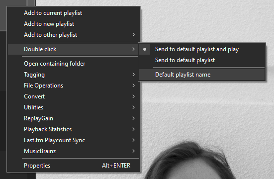
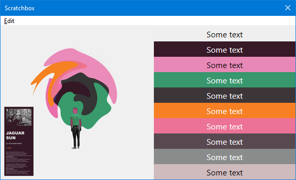

!!! note
	[foobar2000](https://www.foobar2000.org) `2.0` was a requirement for the `3.1.x` and `3.2.x`
	series of releases but support for `1.6.6+` was added in `3.3.0`.

## 3.1.18
- Fix regression from `3.1.17` where resources may not have been freed correctly on shut down. This would only affect scripts that used `utils.LoadSVG`.

## 3.1.17
- The `SVG` renderer now supports `text`.

## 3.1.16
- Fix `JS Playlist` bug which prevented setting a custom group header height.
- Other minor bug fixes.

## 3.1.15
- Update `utils.LoadSVG` to use a better rendering library.

## 3.1.14
- Fix bugs with `IJSGraphics` `FillGradientRectangle` / `FillGradientRectangleAdvanced`.
- `on_library_items_changed` has a new `fromhook` argument. Will be `true` if changes comes from `Playback Statistics` or other components that utilise the same DB functionality.

## 3.1.13
- Fix `Thumbs` sample so existing images are not downloaded again.

## 3.1.12
- This is just a maintenance release with some bug fixes.

## 3.1.11
- The `Text Display` sample has been updated with simple scroll support. Existing users must re-import the script using the `Samples` button in the [Configuration Window](../configuration-window.md).
- Add [utils.CreateTextLayout2](../namespaces/utils.md#utilscreatetextlayout2text-fonts-text_alignment-paragraph_alignment-word_wrapping-trimming_granularity). This allows the scrolling of styled text.
- Update [utils.CreateTextLayout](../namespaces/utils.md#utilscreatetextlayouttext-font_name-font_size-font_weight-font_style-font_stretch-text_alignment-paragraph_alignment-word_wrapping-trimming_granularity) with `trimming_granularity` argument.

## 3.1.10
- Fix `Text Display` bug where the `$font` parsing code was broken if `$rgb` code was not also present.

## 3.1.9
- The `Text Display` sample has been updated to support custom `$font` title formatting. See [this](../../gallery/text-display.md#title-formatting) page for full details.

## 3.1.8
- Fix `utils.ReplaceIllegalChars` regression in `3.1.7`.

## 3.1.7
- If you use `Columns UI`, the component now requires the latest [2.0.0-alpha.5](https://www.foobar2000.org/components/view/foo_ui_columns).
Dialogs now respect the `Columns UI` `Dark Mode` settings and the `on_colours_changed` / `on_font_changed` callbacks also require it to function properly.
- [fb.GetLibraryItems](../namespaces/fb.md#fbgetlibraryitemsquery) now accepts an optional `query` argument which utilises new `foobar2000` `2.0` code. Unlike
`IMetadbHandleList GetQueryItems`, no errors are thrown and all items will be returned if the `query` is invalid.
- Various sample fixes.

## 3.1.6
- `plman.IsPlaylistLocked` and `plman.IsAutoPlaylist` have been updated so the supplied `playlistIndex` no longer has to
be valid. This should fix `JS Playlist` and `Smooth Playlist Manager` from occasionally throwing errors when playlists are removed.

## 3.1.5
- Changing the [Editor Properties](../configuration-window.md#editor-properties) is now done via a new `Style`
button in the [Configuration Window](../configuration-window.md).

## 3.1.4
- Fix issue where `WebP` album art wasn't handled internally.

## 3.1.3
- Support for `WebP` images is now built in to the component. Using the `Windows Imaging Component (WIC)`
was not reliable and may have caused display issues in recent changes to the `Spectrogram Seekbar` scripts.

## 3.1.2
- Update [Text Display](../../gallery/text-display.md) with album art background option. Existing users must re-import from the `Samples` button.

## 3.1.1
- [on_metadb_changed](../callbacks/foobar2000.md#on_metadb_changedhandle_list-fromhook) has had the `fromhook` argument restored.
- Hopefully prevent `Smooth Browser` from updating itself when plays are recorded by `Playback Statistics`.

## 3.1.0

### Changes
- The minimum requirement for [foobar2000](https://www.foobar2000.org) is now `2.0`.
- The `Editor Properties` in the main `Preferences` will be reset as the component now uses a brand new storage
mechanism built in to [foobar2000](https://www.foobar2000.org).
- [window.IsDark](../namespaces/window.md) has been updated to report `Default UI` `Dark Mode`.

### New additions
- `64bit` builds are now available.
- The `Preferences` and all popup dialogs have been updated to support `Dark Mode`. This depends on `Dark Mode`
being enabled in the `Default UI` `Preferences` regardless of which user interface you use.
- The colours for the text edit area in the [Configuration Window](../configuration-window.md) do not change
dynamically. If using `Dark Mode`, try the new `Dark Grey` preset.
- The [IMetadbHandle](../interfaces/IMetadbHandle.md) interface has a new `FileCreated` property. Unlike the new `%file_created%`, this is a timestamp.
- There is a new [on_console_refresh](../callbacks/foobar2000.md#on_console_refresh) callback and you can retrieve
all `Console` messages using [console.GetLines](../namespaces/console.md#consolegetlineswith_timestamp). Additionally,
you can clear all messages with [console.ClearBacklog](../namespaces/console.md#consoleclearbacklog).
- The [on_main_menu](../callbacks/component.md#on_main_menuindex) callback last seen in the `2.x` series is back.
- Add [utils.TextBox](../namespaces/utils.md#utilstextboxprompt-title-default_value) which
provides a multi-line text edit area. Note that it always throws an error when cancelled so you must use `try/catch`.
- Add [utils.Run](../namespaces/utils.md#utilsrunapp-params).
- Add [utils.RunCmdAsync](../namespaces/utils.md#utilsruncmdasyncwindow_id-app-params) and [on_run_cmd_async_done](../callbacks/component.md#on_run_cmd_async_donetask_id).
- Add [ITitleFormat EvalPlaylistItem](../interfaces/ITitleFormat.md#evalplaylistitemplaylistindex-playlistitemindex). This is
in addition to the [ITitleFormat EvalActivePlaylistItem](../interfaces/ITitleFormat.md#evalactiveplaylistitemplaylistitemindex) that existed previously.
- Various other improvements using new `SDK` features.

### Changes to clickable ratings (`JS Playlist`, `Smooth Playlist`)

!!! note
	These changes apply to the `3.1.x` series of components only. As of `foobar2000` `2.0 Beta 18`
	and component version `3.2.0`, detecting and using `foo_playcount` for `Playback Statistics`
	will be restored.

[foobar2000](https://www.foobar2000.org) now has built in `Playback Statistics` which makes `foo_playcount` obsolete.
The clickable `RATING` stars in `JS Playlist` and `Smooth Playlist` previously relied on detection of that
component to determine whether to use `Playback Statistics` or write file tags but since that is no longer
possible, the following changes have been made:

- `JS Playlist` users must configure the title formatting in the `RATING` column to use `%rating%` for
`Playback Statistics` or `$meta(rating)` for file tags. The script will detect which is in use
when clicked. Note that the default is `%rating%`.
- `Smooth Playlist` users must choose which to use from the right click menu under `Track Info`.

### Sample changes

!!! note "Important note for current JS Playlist users"
	`JS Playlist` has had some internal changes made which means previous column/group settings will not
	be retained if upgrading from an earlier version. Make a copy of any complex title formatting strings first.

	The `Cover` column and `Extra Rows` options have both been removed. `$rgb` title formatting should work
	again. It seems that it was broken during the transition to `3.0.0`.

!!! note
	Existing users of these samples must re-import using the `Samples` button. This is for bug fixes
	and new functionality.

	- Last.fm Artist Info + User Info (previously similar artists + charts)
	- Text Display (This has had a major update to be more like the old `foo_textdisplay` component. It has full `$rgb` support and can display coloured emoji if using `Windows 10` or later.)
	- Text Reader (Use this for displaying the contents of text files.)
	- Spectrogram Seekbar
	- Track Info + Seekbar + Buttons
	- Track Info + Spectrogram Seekbar + Buttons

- The `Spectrogram Seekbar` samples now save the cached images as `WebP` which are much smaller. For existing
users, it will make a one time offer to delete any existing `PNG` files in your cache folder.

- `Smooth Browser` has some new add/send to playlist options:

	

- The `basic\GetColourScheme` sample for extracting the most dominant colours from an image has been updated with a `DetermineTextColour`
function to calculate whether to write black or white text depending on the luminance of the background. The code for this was actually taken from the `foobar2000 SDK (C++)`
and converted to `JavaScript`. Credit must to go Peter Pawlowksi who is the author of [foobar2000](https://www.foobar2000.org).

	

- The same `DetermineTextColour` method used above has been used to improve the text colour used on selected items in the `JS Playlist` and `Smooth` samples.

- The `Properties` sample has been updated to display the new `%file_created%` field that is built in to [foobar2000](https://www.foobar2000.org).

- The `Autoplaylists` sample has been removed.
