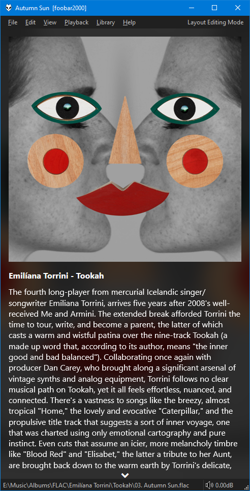

!!! note
	Component version `3.3.20` or later is required for the functionality
	shown in these screenshots.

=== "Allmusic"
	

=== "Allmusic + Album Art"
	

This pulls album reviews from `allmusic.com` using `%album artist%` / `%album%` tags.
Success or failure is reported in the [foobar2000](https://foobar2000.org) `Console`.
