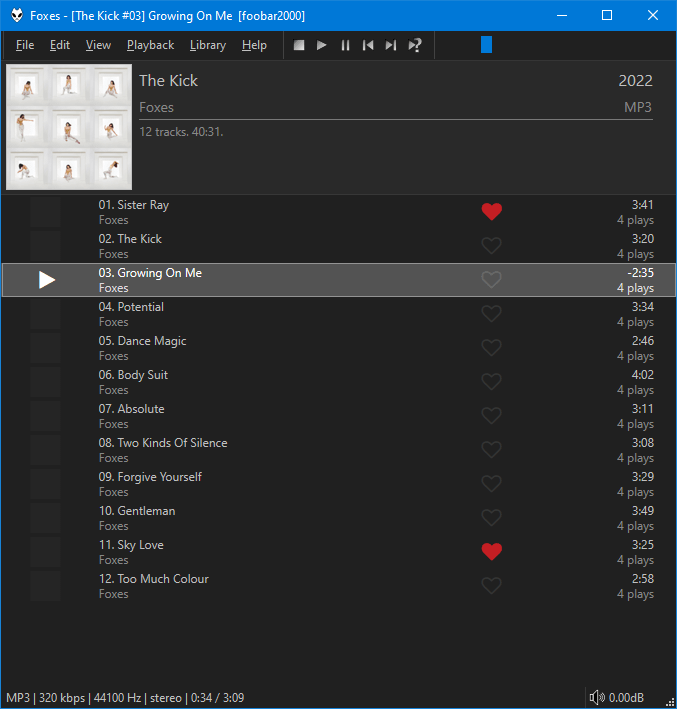

This was originally created by [Br3tt aka Falstaff](https://www.deviantart.com/br3tt).

## Clickable ratings
!!! note
	The behaviour of clickable ratings depend on the presence of `foo_playcount`. When installed,
	`Playback Statistics` will be used. Without it, `RATING` tags are written
	to your files.

	There were changes during the `3.1.x` series of components but `foobar2000` `2.0 Beta 18`
	dropped its internal `Playback Statistics` and the previous behaviour of using
	`foo_playcount` has been restored. Component version `3.2.0` or later is required to
	be compatible with this update.

## Features
- Full drag/drop including to exeternal panels.
- Customisable group headers with album art, expand/collapse, etc.
- Smooth Scrolling.
- Arrange columns using drag/drop, create custom columns with title formatting and full $rgb support.
- Playlist specific tags like `%list_index%`, `%list_total%`, `%isplaying%`, `%queue_index%` etc are fully supported.
- Optional playlist info header.
- Use album art or a custom image as background wallpaper.
- Use the middle click mouse button or tab key to open the built in `Playlist Manager`. This has advanced features
 such as the ability to sort playlists by name and apply [playlist locks](../images/playlist-lock.png).
- Check the right click menu and `Panel settings` for all options.

## Tips
- Change colours and fonts in [foobar2000](https://foobar2000.org) `Preferences` > `Display` > `DefaultUI` or `ColumsUI`
- Alternatively, you can configure independent custom colours from the right click menu.
- Right click on the columns toolbar to toggle columns on/off. Use the main `Panel settings` to customise them.
- ++ctrl+'T'++ to toggle the columns toolbar.
- ++ctrl+'I'++ to toggle the playlist info panel.
- ++ctrl+'C'++, ++ctrl+'X'++, ++ctrl+'V'++ to copy/cut/paste using the `Windows Clipboard`. Clipboard contents can now be pasted in `Windows Explorer`.
- Use ++'F2'++ key to rename active playlist in playlist manager panel.
- Use ++'F5'++ key to refresh covers.

## Loving tracks on Last.fm with foo_lastfm_playcount_sync
It's now possible to love/unlove tracks on Last.fm directly from clicking on the hearts in the `MOOD` column. This feature can be enabled
in the Properties window. Hold ++shift+++++windows++ before right clicking. The option is named `Love tracks with foo_lastfm_playcount_sync`.

### Setup
- You must have [foo_lastfm_playcount_sync](https://marc2k3.github.io/component/lastfm-playcount-sync/) installed, configured
and authenticated with your [Last.fm](https://www.last.fm) account.
- You must have imported your `Last.fm` loved tracks via the main `Library` menu because it works as a toggle for the current value.
- You must enable the `MOOD` column and configure it in the settings to display `%lfm_loved%`. Ensure this is displaying your imported
loved tracks as expected before clicking anything!

### Usage
Now when you click the heart, it loves/unloves tracks directly on [Last.fm](https://www.last.fm). Only a succesful response from the server
will make the icon update. Check the [foobar2000](https://foobar2000.org) `Console` for messages if not working as expected.
