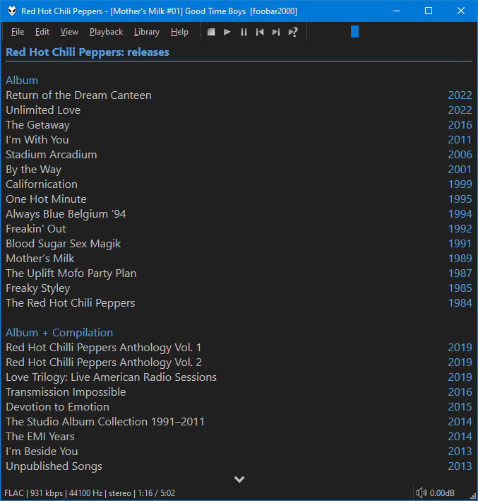
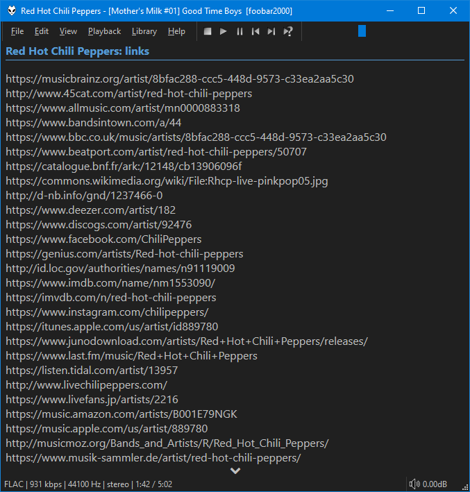

=== "Releases"
	

=== "Links"
	

This script requires `musicbrainz_artistid` or `musicbrainz artist id` tags present in
your files. It cannot function without them.

`Releases` mode displays all the `release groups` for the given artist. They are clickable
so you can read more on [MusicBrainz](https://musicbrainz.org).

`Links` mode returns all the manually curated external links for the artist such
as their home page/twitter/last.fm/other databases etc.
