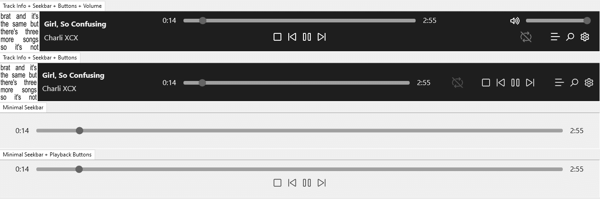

!!! note
	`Minimal Seekbar + Buttons` is only available in component version `3.6.0` and later.

	Both `Minimal` seekbars are `Dark Mode` aware and will update themselves when toggled.

!!! note
	Right click the `Stop` button in any sample to toggle `Stop After Current`. It changes
	colour to indicate that it is enabled. It also updates itself whenever it's toggled
	via other means.
