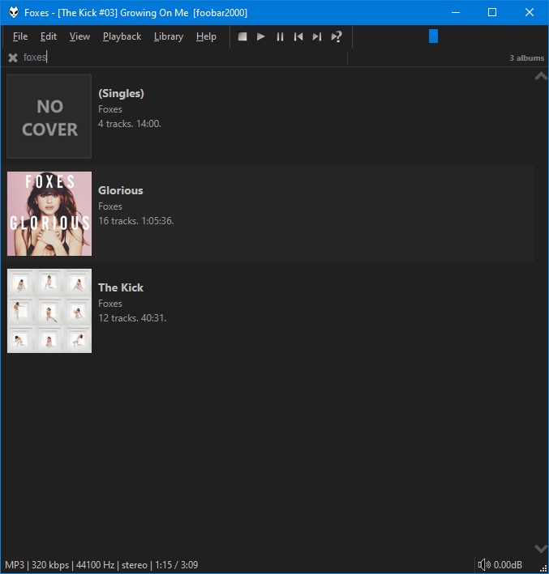
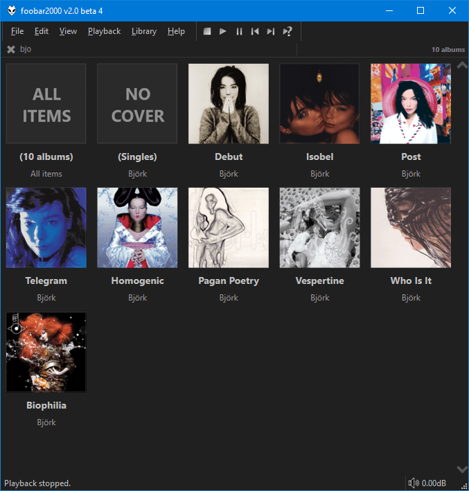

This was originally created by [Br3tt aka Falstaff](https://www.deviantart.com/br3tt).

=== "Column + Album Art"
	

=== "Album Art Grid (Original style)"
	

!!! note
	Performance may appear sluggish on first run/scrolling through new items
	as copies of the album art are resized and cached. Being `JavaScript` based,
	this runs in the main thread. Subsequent loading should be faster.

## Features
- Single click highlights the selection only.
- Use the right click menu to add to current/new/other playlists.
- Double click to send to playlist and play or just send without playing. Check the right click menu for [options](../images/smooth-browser-playlist-options.png).
- 3 column modes available:
    * Album
    * Artist
    * Album Artist
- 4 display modes avaliable:
    * Column
    * Column + Album Art
    * Album Art Grid (Original style)
    * Album Art Grid (Overlayed text)
- Filter box with full `Media Library` query support.
- Smooth scrolling

## Tips
- Change colours and fonts in [foobar2000](https://foobar2000.org) `Preferences` > `Display` > `DefaultUI` or `ColumsUI`
- Alternatively, you can configure independent custom colours from the right click menu.
- ++ctrl+'T'++ to toggle the info bar
- ++ctrl++ + mouse wheel to zoom
