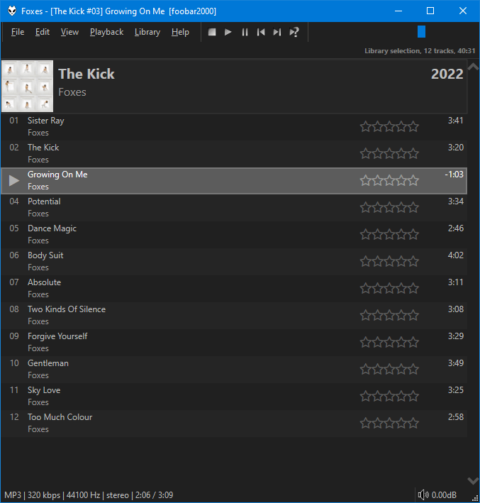

This was originally created by [Br3tt aka Falstaff](https://www.deviantart.com/br3tt).

## Clickable ratings
!!! note
	The behaviour of clickable ratings depend on the presence of `foo_playcount`. When installed,
	`Playback Statistics` will be used. Without it, `RATING` tags are written
	to your files.

## Features
- Variable height group headers with album art. Right click the header bar or scrollbar to change options/turn off grouping.
- Cover art or custom image as background supported (including a blur effect).
- Smooth scrolling.
- Support for dynamic colours extracted from the front cover of the playing item was added in component versions `3.0.24` and `3.2.12`.
- Change colours and fonts in [foobar2000](https://foobar2000.org) `Preferences` > `Display` > `DefaultUI` or `ColumsUI`.
- Alternatively, you can configure independent custom colours from the right click menu.
- Use ++ctrl+'T'++ to toggle the info bar.
- Use ++ctrl++ + mouse wheel to zoom.
- Use ++ctrl+'C'++, ++ctrl+'X'++, ++ctrl+'V'++ to copy/cut/paste using the `Windows Clipboard`. Clipboard contents can now be pasted in `Windows Explorer`.

## Limitations
- This is very basic and is in no way equivalent to a proper playlist viewer.
