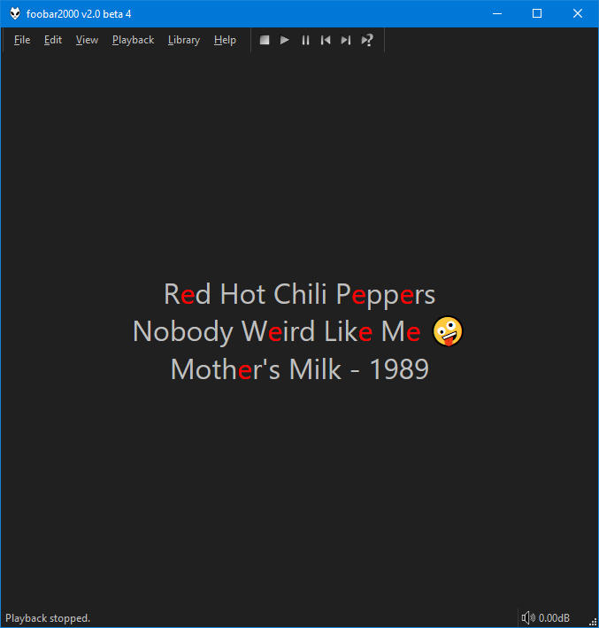

!!! note
	This is only available in `3.1.0` and later.



## Title Formatting
You can enable `per-second` updates if you want to display `%playback_time%` etc.

[Playlist only fields](https://wiki.hydrogenaud.io/index.php?title=Foobar2000:Title_Formatting_Reference#Playlist-only_fields) like `%list_index%`, `%list_total%`, etc are supported.

### Colours
The script includes a custom title formatting parser which supports the following colour
related functions:

```
$rgb(r,g,b) // only the 3 value variant is supported
$rgb()
$hsl(h,s,l) // only the 3 value variant is supported
$hsl()
$blend(colour1,colour2,part,total)
$transition(string,colour1,colour2)
```

You can read about their usage [here](https://wiki.hydrogenaud.io/index.php?title=Foobar2000:Title_Formatting_Reference#Historical_and_Columns_UI_color_functions).

### Fonts
As of component version `3.1.9`, a `$font` function has been added. This is not a
common function and is exclusive to `JScript Panel 3`. It takes up to 6 values.

`$font(name,size,weight,style,underline,strikethrough)`

If changing the font, you must the supply the `name` and `size` values. The rest are optional.

|Value||
|---|---|
|size|Supported values are `8` - `144`.
|weight|Default `400`, `700` is bold. Supported values are `100` - `950`.|
|style|Default `0`. Use `1` for `oblique` or `2` for `italic`.|
|underline|Default `0`. Use `1` to enable.|
|strikethrough|Default `0`. Use `1` to enable.|

You can use `$font()` with no values to reset back to default.

## Other features
Coloured emoji are supported if running `Windows 10` or later.

It has various text alignment options available via the right click menu.

As of component version `3.1.2`, displaying album art as the background is supported.
