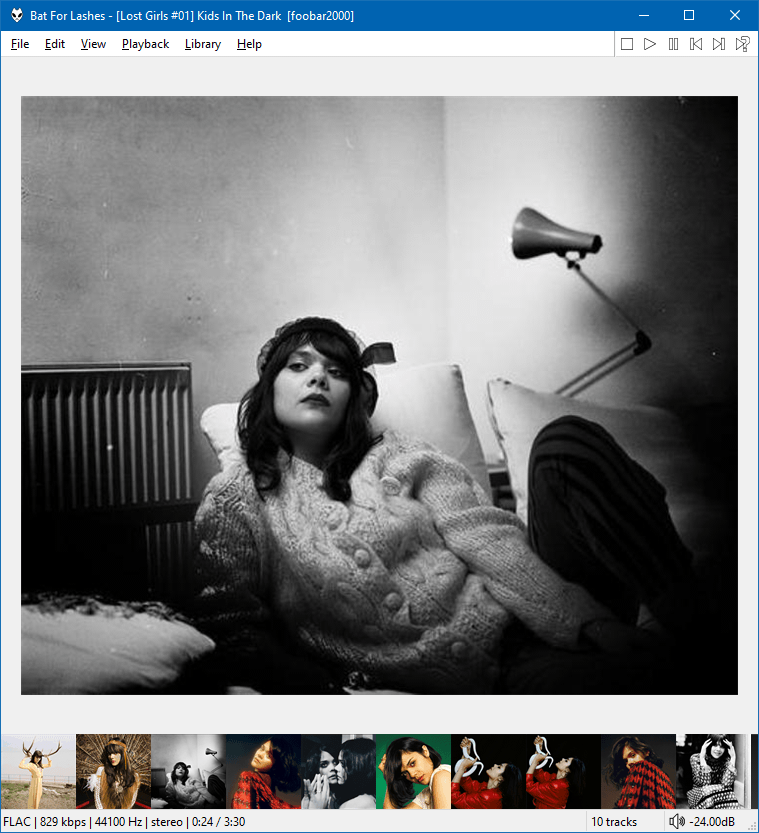

By default it will display multiple images (if present) inside the same folder as the
playling/selected file. The folder path can be configured via the right click menu.

Alternatively, you can put it [Last.fm](https://www.last.fm) mode and it can download images.
You can trigger downloads manually or enable automatic downloads which is off by default.

There are many options for thumbnail size and alignment via the right click menu. Circular thumbnails
can also be enabled.
