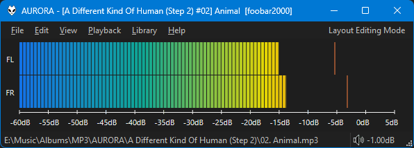

:octicons-tag-24: 3.6.7

This was written by `Case` because I have no idea how to the use
real time audio data provided by [fb.GetAudioChunk](../docs/namespaces/fb.md#fbgetaudiochunkrequested_length-offset).

Check the right click menu for all of its options. Labels can be hidden if you resize it small enough.
